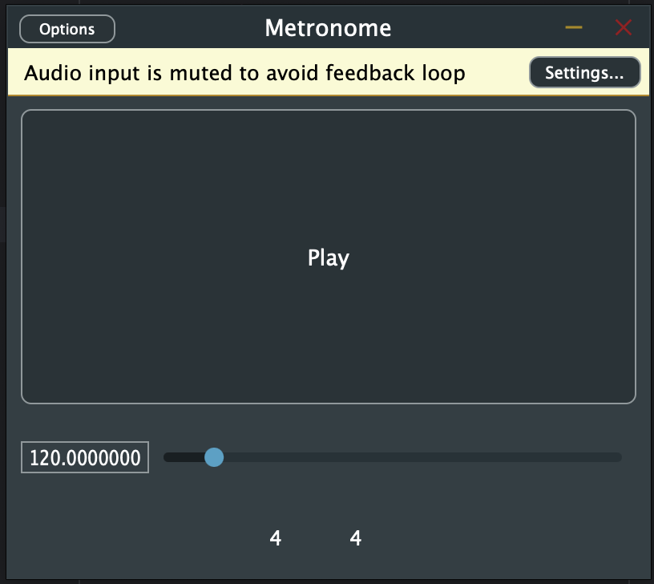

# JUCE Metronome
A basic metronome implementation. The UI is not pretty but this was great practice audio programming!
Timing of the metronome is synched to the system audio clock by keeping count of the samples of audio/time that pass in the audio buffer in the audio process callback.
Although the metronome can be built as a plugin, it does not sync to the DAW's timeline. Although, I could add DAW timeline synch functionality
by querying JUCE's `AudioPlayHead` object in the `PluginProcessor`.

## How to Build
If you use CLion IDE, open the project, refresh CMake and run the target `Metronome_Standalone`.

#### Using Command Line:
1. Install CMake 3.22 or higher
2. `cd` into this folder
3. Run `cmake -Bbuild`
4. Run `cmake --build build --target Metronome_Standalone`
5. Go to folder `build/Metronome_artefacts/Standalone/` and run the Metronome application.

## Features

- Play / Stop
- BPM (20-1000)
- Time Signature - left number is numerator, right number is denominator. Click the numbers to type a new value.

I handled edge cases such as:
- User moving the slider while the metronome is playing. Instead of restarting the audiotimeline for every change of the slider, I allow the audio timeline to continue and speed up or slow down dynamically.
- Text input in the time signature is validated. The numerator can be any whole number 1-99. The denominator can only be powers of two.
- The metronome can handle very fast BPM and time signature combinations with large audio buffer size settings where multiple metronome beats may occur in the same audio buffer.

## Future Work
- To make fast BPMs less jarring between audio samples, I could fade between samples.
- Make a mode that synchs with the DAW.
- Make the UI pretty.